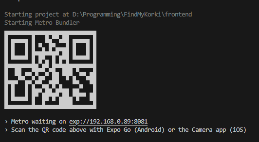

# Setup

1. Get backend by running this command
``` 
.\startup.sh 
```

After docker compose up you can view the frontend on your phone by entering https://192.168.0.89:8081.

Or you can use expo app and enter the url here if you use Android.

Normally, there should be a QR code coming from the frontend, but that doesn't work in Docker (or I don't know how to set it up, sorry)

You can try using this one below 
                  |
                  V
