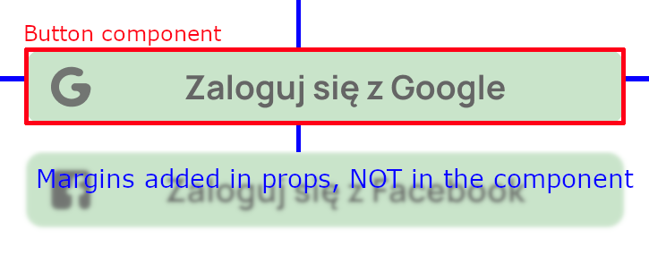

## Docker-compose configuration


1. Get backend by running this command
``` 
.\startup.sh 
```

After docker compose up you can view the frontend on your phone by entering https://192.168.0.89:8081.

Or you can use expo app and enter the url here if you use Android.

Normally, there should be a QR code coming from the frontend, but that doesn't work in Docker (or I don't know how to set it up, sorry)

You can try using this one below


# Project conventions

## 1. Directory Structure
In the project, we will use the following directory structure:
```
├── components/  # Reusable components that will be used in multiple places (e.g., ActionButtonsPanel, which can be used in several screens)
├──├──xyz_screen # Components specific to particular screens (e.g., CalendarView in ClassDateScreen)
├── screens/     # Application screens
├── sheets/      # BottomSheetModal components
├── hooks/       # Custom hooks
├── services/    # API, WebSockets, etc.
├── store/       # Context files
├── types/       # Type-related files
├── utils/       # Utility functions
├── assets/      # Images, fonts, etc.
├── navigation/  # All navigation-related files
```

## 2. Component Styles
We use `NativeWindCSS` for styling, and its documentation can be found [here](https://www.nativewind.dev/). Additionally, when creating any type of components, **we DO NOT add external margins**. We add them directly as props to the components, as shown in the example below.



## 3. Code Style

In this project, we use **Prettier** in combination with *Husky* and *Lint-staged* to automatically format the code before each commit. This ensures consistent code formatting without the need to manually run the formatting. Each time you perform a `git commit`, a pre-commit hook will run that: 
- Finds modified `.js`, `.ts`, `.tsx`, `.json`, and `.md` files (those added to `git add`)
- Automatically formats them using Prettier. If formatting is applied, the changes are saved, and the commit will proceed.

If you want to format files manually, you can use: `prettier --write /app`

The `.prettierrc` file contains the formatting settings for the project:
 - **`semi: true`** – Adds semicolons at the end of lines.
 - **`singleQuote: true`** – Uses single quotes instead of double quotes.
 - **`trailingComma: "all"`** – Adds commas at the end of lists and objects to ease versioning.
 - **`printWidth: 100`** – Sets the maximum line length to 100 characters.
 - **`bracketSpacing: true`** – Adds spaces between braces in objects (`{ key: value }`).

Additionally:
- Every line should end with a semicolon `;` – this is also configured by Prettier.
- **File naming convention**: We use `PascalCase.js` for components and classes, and `camelCase.js` for helpers.

## 4. Application State
In cases where we need to store data on the device, we use Context API. This is a built-in mechanism for managing the global state of the application without the need to pass props through multiple levels of components. It also stores the data when the application is closed. For example, it can store data about the logged-in user (token, preferences), app settings (dark/light mode), or the app's language.

## 5. Typing
In the **`types/`** folder, we will place all TypeScript types used in various parts of the application. This will help avoid duplicating types and maintain better code organization. For example:
```
export type User = {
  id: string;
  name: string;
  email: string;
  avatarUrl?: string;
};
```

## 6. Navigation Management
To pass props to a component, we always define the type of that component before the function returning the component, as shown in the example below:
```
import { FC } from "react";  
import { View, Text } from "react-native";  
  
type ExampleComponentType = {  
  exampleProp: string;  
  className?: string  
}  
  
const ExampleComponent: FC<ExampleComponentType> = ({ exampleProp, className }) => {  
  return (  
     <View className={`bg-primary p-10 ${className}`}>  
         <Text className={`text-white`}>{exampleProp}</Text>  
     </View>  
  );  
}  
  
export default ReusableExampleComponent;
```

## 7. Branch Naming Convention 
Branches should follow a structured naming pattern to maintain clarity and consistency:  

- **Feature branches:** `feature/<short-description>`  
  - Example: `feature/user-authentication`  
- **Bug fixes:** `fix/<short-description>`  
  - Example: `fix/login-redirect`  
- **Hotfixes:** `hotfix/<short-description>`  
  - Example: `hotfix/critical-crash`  
- **Refactoring:** `refactor/<short-description>`  
  - Example: `refactor/improve-api-structure`  
- **Documentation:** `docs/<short-description>`  
  - Example: `docs/update-readme`   

## 8. Commit Message Convention  
Commit messages should be written in **present simple tense**, using lowercase beginning with a capital letter and imperative form. If possible, add references to corresponding issues by adding hash of the issue at the end of the message.

### **Examples:** 
```sh
Add jwt authentication #2 #3
Fix button alignment issue #32
Update setup instructions #21
Simplify user data fetching #15
Add unit tests for date formatting  
```

